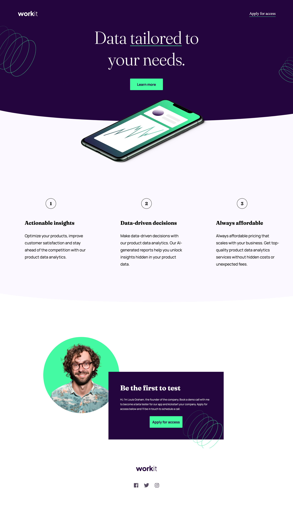
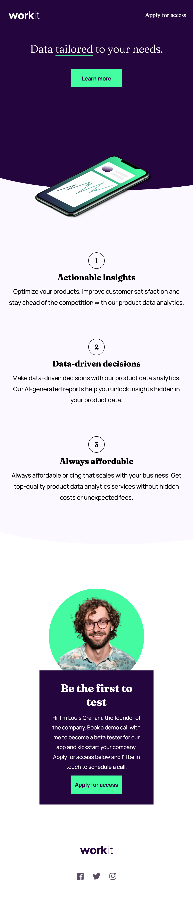

# Frontend Mentor - Workit landing page solution

This is a solution to the [Workit landing page challenge on Frontend Mentor](https://www.frontendmentor.io/challenges/workit-landing-page-2fYnyle5lu). Frontend Mentor challenges help you improve your coding skills by building realistic projects.

## Table of contents

- [Overview](#overview)
  - [The challenge](#the-challenge)
  - [Screenshot](#screenshot)
  - [Links](#links)
- [My process](#my-process)
  - [Built with](#built-with)
  - [What I learned](#what-i-learned)
  - [Continued development](#continued-development)
- [Author](#author)

**Note: Delete this note and update the table of contents based on what sections you keep.**

## Overview

### The challenge

Users should be able to:

- View the optimal layout for the interface depending on their device's screen size
- See hover and focus states for all interactive elements on the page

### Screenshot

### Links

- Live Site URL: [https://madroosterlab.github.io/FEM-Workit](https://madroosterlab.github.io/FEM-Workit)

## My process

### Built with

- Semantic HTML5 markup
- Flexbox
- Mobile-first workflow

### What I learned

Damn! This one took forever to do. I pulled some tricks out of my sleeves. My code is very messy and not dry but at least I got it all to work!

### Continued development

I have to make an attempt to clean up that code!

## Author

Jon Avila

- Website - [madroosterlab.com](https://www.madroosterlab.com)
- Frontend Mentor - [@yourusername](https://www.frontendmentor.io/profile/madroosterlab)
